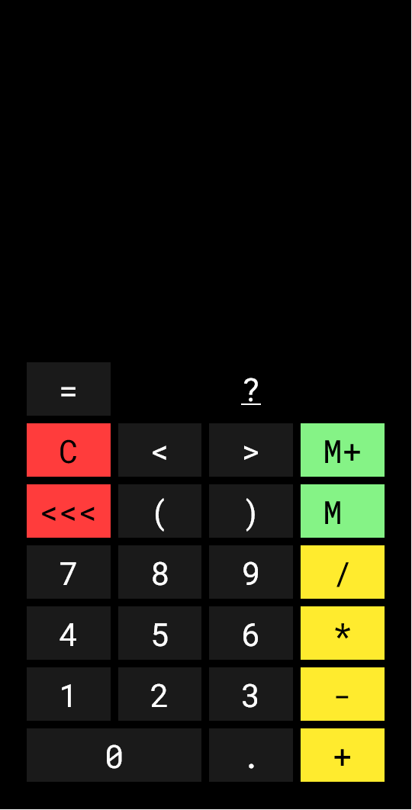
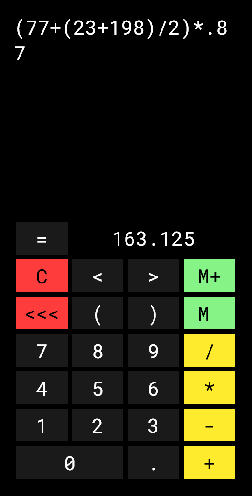
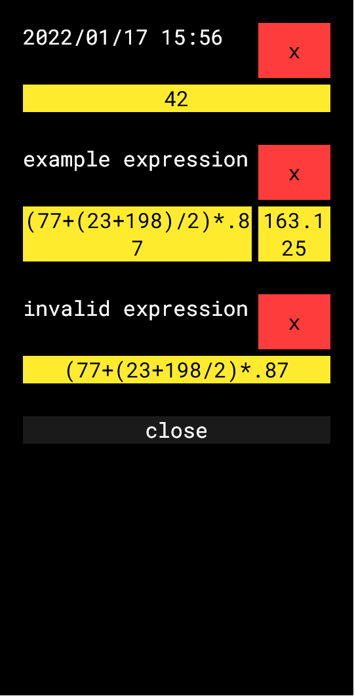

# Chronicalc - a calculator

The Chronicalc web app is a free advanced calculator that can be installed as a progressive web app on iOS and Android. The application can be accessed at [https://chronicweirdo.github.io/calculator/](https://chronicweirdo.github.io/calculator/)

## Features

|invalid expression|valid expression|
|:---:|:---:|
|||

- when no valid expression is on screen, the result area displays a "?" mark; clicking on this mark will take you to this readme page
- when no valid expression is written on screen, and the result field display a "?" mark, clicking on "=" will refresh the page
- when a valid expression is written on screen, and a number is displayed in the result field, clicking on "=" will copy the result to clipboard
- to delete the entire expression you must use a long press on the C button
- a long press on "M+" will save the current expression and result to memory
- clicking on "M" will open the memory screen
- the "<" and ">" buttons can be used to move the caret inside the expression input element
- when in landscape mode, a long press of either the "<" or ">" will move the input controls to the left or the right side of the screen, allowing use of the app with either the left or the right hand; this setting is memorized for the next time you open the app in landscape mode

### On the memory screen

|memory screen|
|:---:|
||

- saved expressions are displayed in two rows, with the name and delete button of the expression on the first row and the expression and the result value on the second row
- each expression saved in memory has a name, which by default is the date and time when the expression was saved
- the expression name can be clicked and edited
- expressions in memory are ordered in alphabetical order of their name
- clicking the red "x" button will delete the expression from memory
- clicking on the yellow expression or result will insert either of them in the expression field on the calculator screen, at the last caret position
- if a saved expression is invalid, it will not have a result button, but it can still be inserted in the expression field on the calculator screen
- if a saved entry is only a number without an expression, only the number will be displayed in the memory screen and can be inserted in the expression field on the calculator screen
- the memory screen can be closed by pressing the "close" button